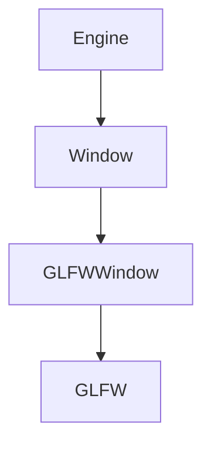
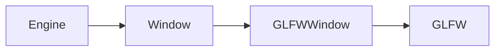
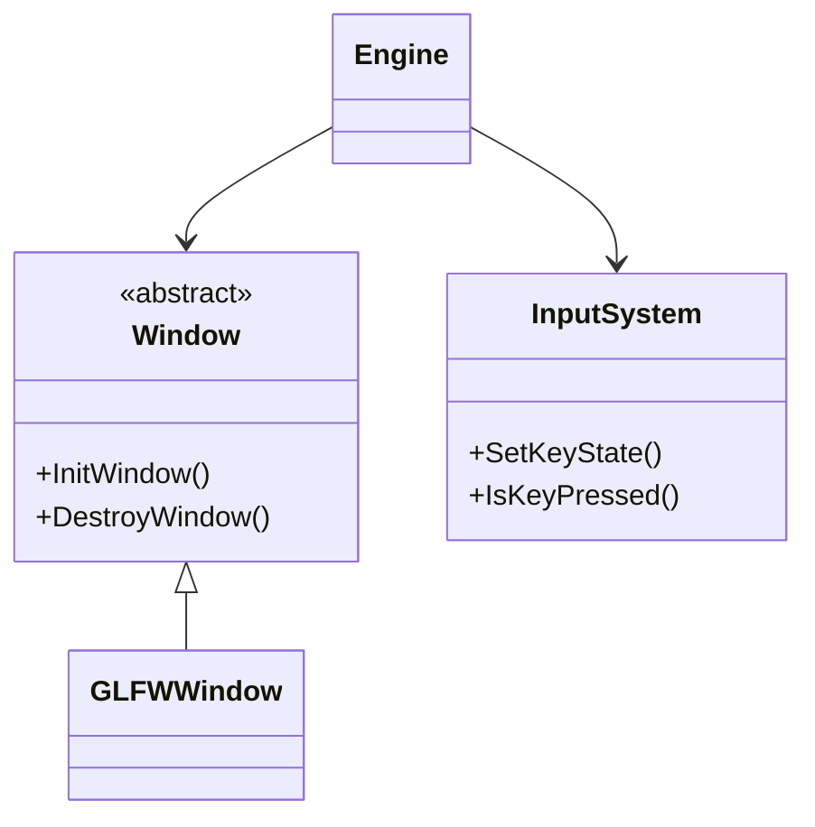
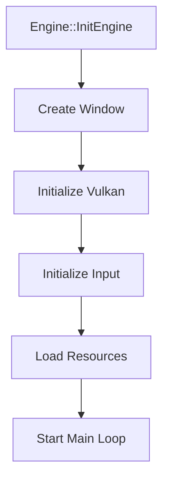
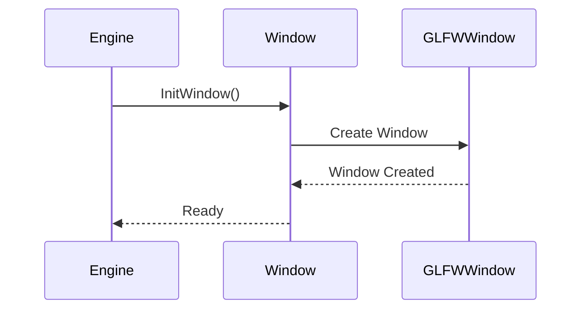
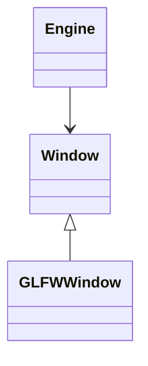
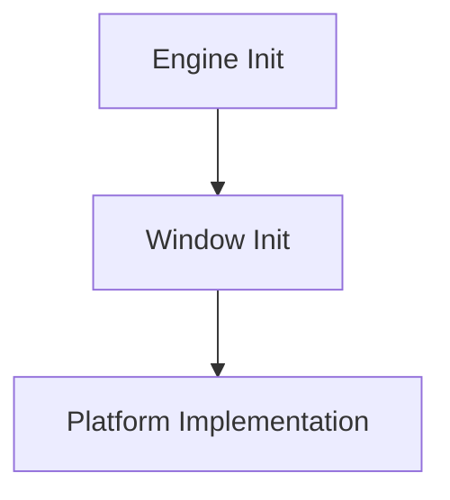

# Engine

Guia del funcionamiento y proceso de desarrollo de un motor de videojuegos desde cero en C++.

## Sección

Esto es una sección

### Subsección

Esto es una subsección

#### Apartado

Esto es un apartado

**Texto importante**

*Texto en cursiva*

***Negrita y cursiva***

- Window
- Input
- Engine


1. Crear la abstracción Window.
2. Implementar GLFWWindow.
3. Separar InputSystem.
4. Actualizar Engine.

- Window
    - Window.h
    - Window.cpp

- Input
    - InputSystem.h
    - InputSystem.cpp


- [x] Crear Window
- [x] Crear GLFWWindow
- [ ] Separar completamente Input
- [ ] Eliminar dependencias directas de GLFW

La clase `Window` define la interfaz.

El método `InitWindow()` inicializa la ventana.

La variable `m_Window` almacena la implementación actual.

```cpp
class Window
{
public:
    virtual void InitWindow() = 0;
    virtual void DestroyWindow() = 0;
};
```

```cmake
target_include_directories(${PROJECT_NAME} PRIVATE
    ${CMAKE_SOURCE_DIR}/Core
)
```


```text
Engine
│
├── Window
│   └── GLFWWindow
│
└── InputSystem
```

```text
1. Engine inicia Window
2. Window crea la ventana
3. Input recibe eventos
4. Engine actualiza sistemas
```

> Esta decisión permite desacoplar GLFW del núcleo del motor.

> **Decisión de diseño:** `Engine` no debe conocer directamente qué librería concreta implementa la ventana.

---

[Texto del enlace](https://ejemplo.com)

[Ir a Input System](../Input/01_InputSystem.md)


# Engine

El sistema de Engine utiliza:

- [Window System](../Window/01_WindowSystem.md)
- [Input System](../Input/01_InputSystem.md)


| Clase | Responsabilidad |
|---|---|
| `Window` | Define la interfaz |
| `GLFWWindow` | Implementación mediante GLFW |
| `InputSystem` | Gestiona el estado del input |
| `Engine` | Coordina los sistemas |

| Sistema | Estado | Prioridad |
|:---|:---:|---:|
| Window | Completado | Alta |
| Input | En progreso | Alta |
| Engine | Pendiente | Media |

→
←
↑
↓
✓
✗
⚠
ℹ


<details>
<summary>Ver arquitectura anterior</summary>

Aquí puedes escribir información adicional.

```cpp
// Código antiguo
```
</details>
















```text# Nombre del sistema

## Objetivo

Explicación general del sistema.

---

## Problema anterior

Cómo funcionaba antes.

### Problemas detectados

- Problema 1.
- Problema 2.
- Problema 3.

---

## Nueva arquitectura

Explicación general.



---

## Organización de archivos

```text
Core/
└── Window/
    ├── Window.h
    └── Platform/
        └── GLFW/
            ├── GLFWWindow.h
            └── GLFWWindow.cpp
```

---

## Clases

### `Window`

Responsabilidad:

- ...
- ...
- ...

### `GLFWWindow`

Responsabilidad:

- ...
- ...
- ...

---

## Flujo de ejecución



---

## Decisiones de diseño

> **Decisión:** explicación de por qué se ha tomado esta decisión.

---

## Estado actual

[x] Implementación inicial.  
[x] Separación de responsabilidades.  
[ ] Soporte Linux.  
[ ] Segunda implementación de plataforma.  

---

## Próximos pasos

1. ...
2. ...
3. ...# Nombre del sistema

## Objetivo

Explicación general del sistema.

---

## Problema anterior

Cómo funcionaba antes.

### Problemas detectados

- Problema 1.
- Problema 2.
- Problema 3.

---

## Nueva arquitectura

Explicación general.


---

## Organización de archivos

```text
Core/
└── Window/
    ├── Window.h
    └── Platform/
        └── GLFW/
            ├── GLFWWindow.h
            └── GLFWWindow.cpp
```

---

## Clases

### `Window`

Responsabilidad:

- ...
- ...
- ...

### `GLFWWindow`

Responsabilidad:

- ...
- ...
- ...

---

## Flujo de ejecución


---

## Decisiones de diseño

> **Decisión:** explicación de por qué se ha tomado esta decisión.

---


## Próximos pasos

1. ...
2. ...
3. ...


Core/
│
├── Engine/
│   ├── Engine.h
│   └── Engine.cpp
│
├── Window/
│   ├── Window.h
│   └── Platform/
│       └── GLFW/
│           ├── GLFWWindow.h
│           └── GLFWWindow.cpp
│
└── Input/
    ├── InputSystem.h
    └── InputSystem.cpp
```