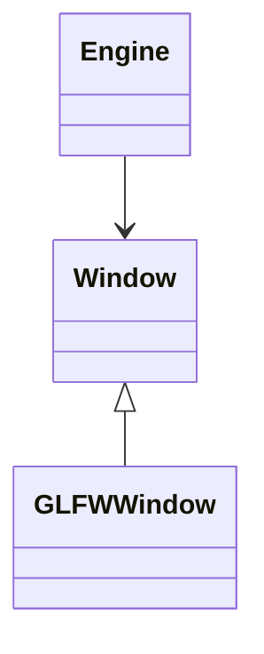
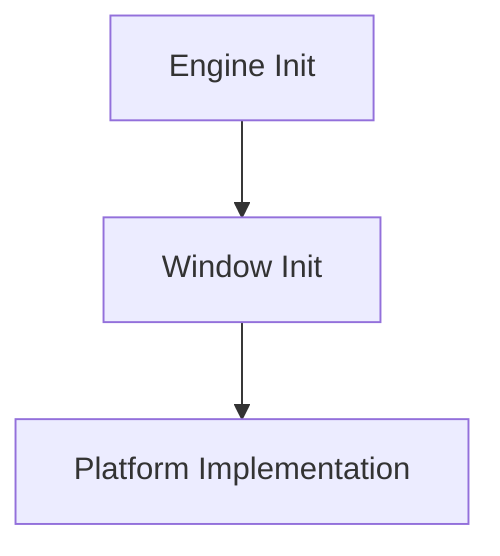

# Sistema de Windows

## Objetivo

Este sistema será el gestor de ventanas de la aplicación. Se usa actualmente una versión con GLFW, pero se tiene una clase abstracta `Window` de donde heredarán los distintos gestores de ventanas.

---


## Arquitectura 

Explicación general.



---

## Organización de archivos

```text
Core/
├── Input/
|    └── Platform/
|        ├── GLFW/
|        |    └── InputMapGLFW.h
|        ├── InputCodes.h
|        ├── InputSystem.h
|        └── InputSystem.cpp
|
└── WindowSystem/
     └── Platform/
         ├── GLFW/ 
         |    ├── GLFWWindow.h
         |    └── GLFWWindow.cpp
         ├── Window.h
         └── WindowContext.h
```

---

## Clases

### `Window`

Responsabilidad:

- ...
- ...
- ...

### `GLFWWindow`

Responsabilidad:

- ...
- ...
- ...

---

## Flujo de ejecución



---

## Decisiones de diseño

> **Decisión:** explicación de por qué se ha tomado esta decisión.

---

## Estado actual

- [x] Implementación inicial.
- [x] Separación de responsabilidades.
- [ ] Soporte Linux.
- [ ] Segunda implementación de plataforma.

---

## Próximos pasos

1. ...
2. ...
3. ...